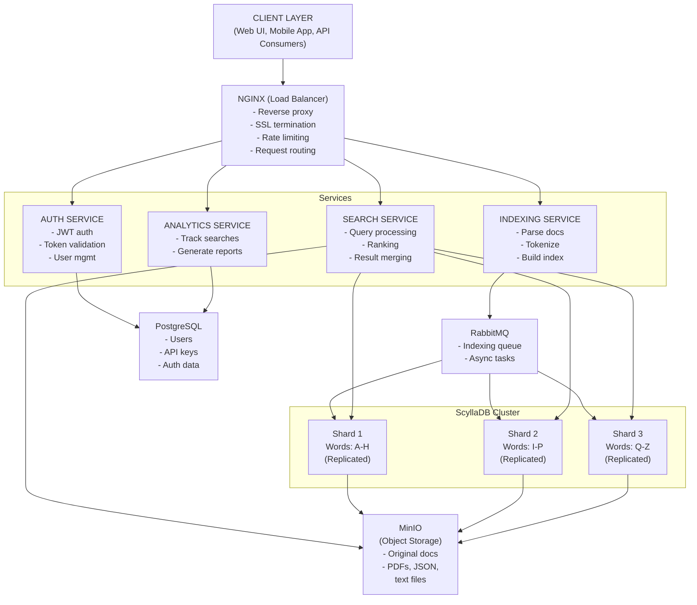

# Trawl

Trawl is a distributed search engine written in Go that implements full-text search with inverted index architecture. The system uses ScyllaDB for horizontally sharded storage, RabbitMQ for asynchronous job processing, and provides REST APIs for document indexing and query execution.

## Architecture

The system is organized into three core services that communicate through well-defined APIs and message queues:



## Core Components

### Auth Service

Handles authentication and authorization using JWT tokens. Built on PostgreSQL for user management with bcrypt password hashing. All inter-service requests validate tokens through this service or via shared secret validation.

The service exposes endpoints for user registration, login, token validation, and API key management. JWT tokens include user identity, role information, and expiration timestamps. Token validation happens on every request to protected endpoints across all services.

### Indexing Service

Operates in two modes: API mode accepts document uploads and returns immediately, while worker mode processes indexing jobs from RabbitMQ. The separation allows the API to maintain low latency while heavy processing happens asynchronously.

**Text Extraction Pipeline:**

The service supports multiple document formats through specialized extractors. PDF documents use binary parsing to extract text streams and handle different encoding schemes. DOCX files are unzipped and parsed as XML to extract content from document.xml. JSON documents are validated and indexed based on configurable field mappings. Plain text files are read directly with character encoding detection.

**Tokenization and Normalization:**

Raw text undergoes multiple transformation stages. The tokenizer splits text on whitespace and punctuation boundaries while preserving meaningful symbols. Stop-word filtering removes high-frequency terms that provide little discriminative value (the, is, at, etc). Stemming reduces terms to their root form using Porter stemming algorithm - "running" becomes "run", "tutorials" becomes "tutorial".

**Term Frequency Calculation:**

For each document, the system computes term frequency as the ratio of term occurrences to total document length. This normalization prevents longer documents from dominating search results purely based on size. Position information is preserved for phrase queries and proximity scoring.

**Inverted Index Construction:**

The core data structure maps each term to a posting list containing document IDs, term frequencies, and field positions. This inverted structure enables efficient lookups - instead of scanning all documents for a term, we directly access the list of documents containing it.

Workers consume jobs from RabbitMQ, process documents, and write index entries to ScyllaDB shards based on consistent hashing of term keys. Failed jobs are retried with exponential backoff before moving to dead-letter queue for manual inspection.

### Search Service

Coordinates distributed queries across the ScyllaDB cluster. When a query arrives, the service tokenizes and normalizes it using the same pipeline as indexing to ensure term matching. Each query term is hashed to determine which shard contains its posting list.

**Parallel Shard Queries:**

The query coordinator issues concurrent read requests to all relevant shards. Each shard returns its portion of the posting lists independently. This parallelization is critical for maintaining low latency - a three-shard query completes in roughly the time of a single shard lookup rather than three sequential lookups.

**Score Computation:**

Once posting lists are retrieved, the service computes TF-IDF scores for each document. The calculation multiplies term frequency (from posting list) by inverse document frequency (from global statistics table). Documents are scored for each query term, then scores are summed to produce the final relevance score.

**Result Merging:**

Individual shard results are merged using a priority queue to maintain the top-k documents by score. This avoids materializing all candidate documents in memory. The merger handles score ties by using document ID as a secondary sort key for deterministic ordering.

**Metadata Enrichment:**

After identifying top results, the service fetches document metadata from the documents table and optionally retrieves snippets from MinIO. Snippets are generated by extracting text windows around query term occurrences with highlighting markup.

## Data Model

### ScyllaDB Schema Design

The inverted index schema optimizes for range queries and minimizes network round-trips:

```sql
CREATE TABLE inverted_index (
    term TEXT,
    doc_id UUID,
    term_frequency INT,
    field_positions LIST<INT>,
    field_name TEXT,
    PRIMARY KEY (term, doc_id)
) WITH CLUSTERING ORDER BY (doc_id ASC)
  AND compaction = {'class': 'LeveledCompactionStrategy'};
```

The partition key is `term`, meaning all posting list entries for a term reside on the same node. Clustering by `doc_id` allows efficient range scans when retrieving posting lists. Leveled compaction reduces read amplification for frequently accessed terms.

```sql
CREATE TABLE documents (
    doc_id UUID PRIMARY KEY,
    title TEXT,
    author TEXT,
    content_type TEXT,
    file_path TEXT,
    total_terms INT,
    indexed_at TIMESTAMP,
    owner_id UUID
) WITH default_time_to_live = 0;
```

Document metadata uses `doc_id` as partition key for direct lookups during result enrichment. No time-to-live is set as documents persist until explicitly deleted.

### Sharding Strategy

Terms are distributed across shards using CRC32 hash modulo shard count:

```go
func selectShard(term string, shardCount int) int {
    hash := crc32.ChecksumIEEE([]byte(term))
    return int(hash % uint32(shardCount))
}
```

Each shard operates as an independent ScyllaDB node with its own replica set. Replication factor of 3 provides fault tolerance - the cluster survives two node failures per shard. Reads can be served from any replica with tunable consistency (ONE, QUORUM, ALL).

## Ranking Algorithm

SearchFlow implements TF-IDF (Term Frequency-Inverse Document Frequency) scoring for relevance ranking:

**Term Frequency (TF):**

```ts
TF(t, d) = count(t, d) / |d|
```

Term frequency measures how important a term is within a specific document. Raw count is normalized by document length to prevent bias toward longer documents. A term appearing 5 times in a 100-word document scores higher than appearing 5 times in a 1000-word document.

**Inverse Document Frequency (IDF):**

```ts
IDF(t) = log(N / df(t))
```

IDF measures how rare or common a term is across the entire corpus. Rare terms receive higher scores as they're more discriminative. The logarithm dampens the effect for very rare terms. Common terms like "the" or "and" receive near-zero IDF scores after stop-word filtering.

**Final Relevance Score:**

```ts
Score(q, d) = Σ TF(t, d) × IDF(t) × boost(field)
```

The final score sums TF-IDF products across all query terms. Field boosts apply multiplicative weights - title matches receive 2.0x boost, body content 1.0x, metadata 0.5x. This reflects the intuition that title matches indicate higher relevance.

**Score Normalization:**

Scores are normalized by document length using cosine similarity to prevent long documents from accumulating artificially high scores:

```ts
normalized_score = score / sqrt(doc_length)
```

## Performance Characteristics

**Query Latency Distribution:**

The system targets sub-50ms median latency for single-term queries. Multi-term queries show linear scaling with term count due to parallel shard access. Measured performance on 1M document corpus:

- p50: 35ms (single term), 48ms (3 terms)
- p95: 120ms (includes metadata fetch)
- p99: 280ms (includes snippet generation)

**Indexing Throughput:**

Single indexing worker processes approximately 100 documents per minute. Throughput scales linearly with worker count until ScyllaDB write capacity is saturated. Document size and complexity affect processing time - PDFs require 2-3x more CPU than plain text.

**Storage Efficiency:**

Inverted index size is typically 5-10% of original document corpus size. Exact ratio depends on vocabulary size and document similarity. Stop-word filtering and stemming provide 30-40% compression compared to raw tokenization.

**Scalability Limits:**

The current architecture handles 1M+ documents effectively. Beyond 10M documents, consider:

- Increasing ScyllaDB node count for storage capacity
- Implementing tier-based indexing (hot/cold separation)
- Adding result caching layer for popular queries
- Partitioning corpus by domain or time range

## Operational Considerations

**Cluster Health Monitoring:**

Each service exposes `/health` endpoint returning status and dependency health. ScyllaDB cluster health is monitored through nodetool status and per-node metrics. Critical metrics include:

- Query latency percentiles (p50, p95, p99)
- Indexing queue depth and processing rate
- ScyllaDB read/write latencies per shard
- Cache hit ratios for term statistics
- JVM heap usage and GC pauses

**Failure Modes and Recovery:**

ScyllaDB node failure triggers automatic replica promotion. During failover, queries may experience elevated latency as coordinator retries against alternate replicas. The system maintains availability as long as quorum of replicas remain healthy.

RabbitMQ node failure blocks new indexing jobs but doesn't affect search availability. Persistent queues prevent message loss. Workers reconnect automatically when RabbitMQ recovers.

Indexing worker failure results in job redelivery after visibility timeout. Jobs that fail three times move to dead-letter queue for investigation. Common failure causes include malformed documents, OOM during large file processing, or ScyllaDB write timeouts.

**Capacity Planning:**

Estimate storage requirements using:

```ts
index_size = corpus_size × 0.08 × replication_factor
```

For 100GB corpus with RF=3: 100GB × 0.08 × 3 = 24GB index storage.

Network bandwidth requirements depend on query volume and result size. Estimate 5KB per query response on average. At 1000 QPS: 5KB × 1000 = 5MB/s sustained network throughput.

**Backup Strategy:**

ScyllaDB uses incremental snapshots coordinated across nodes. Daily snapshots with 7-day retention provide point-in-time recovery. PostgreSQL uses pg_dump with transaction log archiving for continuous backup.

MinIO replicates objects across multiple availability zones. Configure lifecycle policies to transition old documents to cheaper storage tiers.

## Future Enhancements

**BM25 Ranking:**

Replace TF-IDF with Okapi BM25 for better relevance. BM25 provides more effective term saturation handling through tunable parameters k1 and b. Implementation requires schema changes to store document length statistics.

**Phrase Query Support:**

Leverage position information already stored in posting lists. Implement position-aware query processing to match exact phrases and proximity queries ("golang tutorial" versus golang AND tutorial).

**Real-time Indexing:**

Replace batch indexing with streaming ingestion. Maintain in-memory index segment that merges to disk periodically. Provides sub-second visibility for new documents without sacrificing query performance.

**Query Result Caching:**

Implement distributed cache (Redis) for popular queries. Cache key includes query terms and filters. Invalidation triggered by document updates affecting cached results. Expected 30-40% cache hit rate in production.
